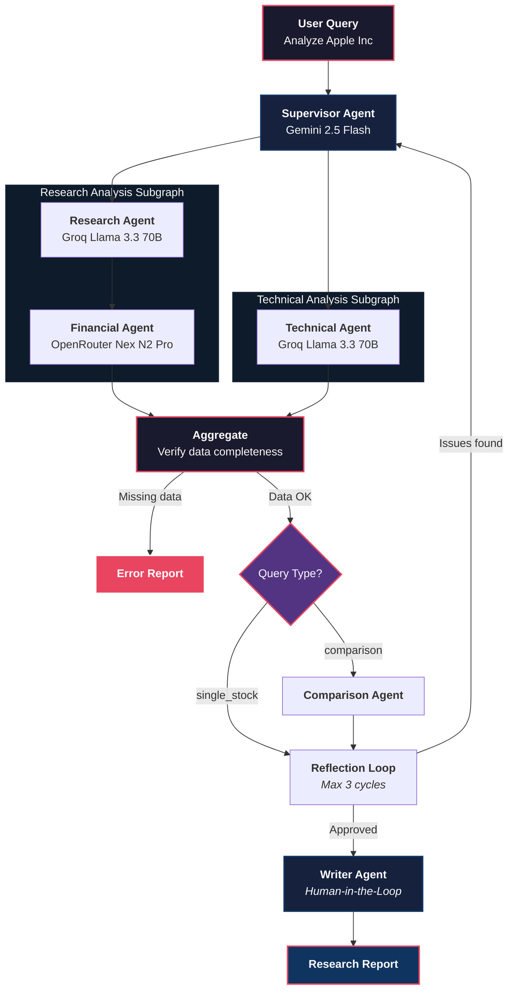

<div align="center">

# AlphaResearch AI

**Autonomous AI Equity Research Platform**

[](https://www.python.org/)
[](https://langchain-ai.github.io/langgraph/)
[](https://fastapi.tiangolo.com/)
[](LICENSE)
[](#testing)

<br>

An autonomous multi-agent system that performs **institutional-quality equity research** using AI.
Think **Perplexity for Stocks** — ask a question, get a full research report backed by real financial data and web sources.

[Getting Started](#getting-started) · [Architecture](#architecture) · [API Reference](#api-reference) · [Configuration](#configuration)

</div>

---

## What It Does

AlphaResearch AI orchestrates a team of specialized AI agents that autonomously research, analyze, and generate professional equity research reports:

| Capability | Description |
|:--|:--|
| **Company Research** | Web research, news analysis, business overview, competitive landscape |
| **Financial Analysis** | Revenue, margins, PE, ROE, debt ratios, cash flow via Yahoo Finance, Finnhub, Alpha Vantage |
| **Technical Analysis** | RSI, MACD, Bollinger Bands, support/resistance, trend direction |
| **Company Comparison** | Head-to-head financial, technical, and valuation comparison |
| **Investment Reports** | Executive summary, investment thesis, valuation, risk assessment, buy/hold/sell |
| **Reflection Loops** | LLM-driven quality review — catches missing evidence, contradictions, weak conclusions |

Every report includes source URLs. Every conclusion has supporting evidence.

---

## Architecture



### Design Principles

- **Source Grounded** — every claim backed by a URL or financial data point
- **Agent Driven** — specialist agents handle their domain, supervisor orchestrates
- **Reflection Based** — LLM reviews findings for quality before report generation
- **Parallel Execution** — research and technical branches run simultaneously
- **Fault Tolerant** — automatic retry with exponential backoff, generous timeouts (10 min run / 2 min idle)
- **Fail-Fast Aggregation** — missing data produces a clear error report instead of garbage output
- **Human-in-the-Loop** — approval step before report generation

---

## Tech Stack

| Layer | Technology |
|:--|:--|
| **Agent Framework** | LangGraph + DeepAgents |
| **Model Routing** | LiteLLM (via `langchain-litellm`) |
| **Primary Model** | Gemini 2.5 Flash (planning, reflection, writing) |
| **Fast Model** | Groq Llama 3.3 70B (research, technical analysis) |
| **Financial Model** | OpenRouter Nex N2 Pro (free) |
| **Fallback** | OpenRouter Free → Gemini Flash |
| **Search** | MCP Web Search Server, DuckDuckGo, Tavily, Google/Brave (optional) |
| **Financial Data** | Yahoo Finance, Finnhub, Alpha Vantage |
| **Vector DB** | ChromaDB (Phase 4 ready) |
| **Backend** | FastAPI |
| **Observability** | LangSmith |
| **License** | MIT |

---

## Getting Started

### Prerequisites

- Python 3.11+
- [uv](https://docs.astral.sh/uv/) (recommended) or pip

### 1. Clone & Install

```bash
git clone https://github.com/himanshu231204/AlphaResearch-AI.git
cd AlphaResearch-AI

# Install with uv (recommended)
uv sync

# Or with pip
pip install -e ".[dev]"
```

### 2. Configure Environment

```bash
cp env.example .env
```

Edit `.env` with your API keys:

```env
# Required — at least one LLM provider
GEMINI_API_KEY=your_gemini_key        # https://aistudio.google.com/apikey
GROQ_API_KEY=your_groq_key            # https://console.groq.com
OPENROUTER_API_KEY=your_openrouter    # https://openrouter.ai/keys

# Optional — financial data
FINNHUB_API_KEY=your_finnhub_key      # https://finnhub.io
ALPHA_VANTAGE_API_KEY=your_alpha_key  # https://www.alphavantage.co

# Optional — enhanced search
TAVILY_API_KEY=your_tavily_key        # https://tavily.com (1000 free credits/month)

# Optional — observability
LANGSMITH_API_KEY=your_langsmith_key  # https://smith.langchain.com
```

### 3. Run Tests

```bash
pytest tests/ -v
```

### 4. Start the API

```bash
uvicorn app.main:app --reload --host 0.0.0.0 --port 8000
```

### 5. Start LangGraph Server (for Agent Chat UI)

```bash
langgraph dev
```

Server runs at `http://localhost:2024`. Connect the [Agent Chat UI](https://github.com/langchain-ai/agent-chat-ui) frontend.

---

## API Reference

### `POST /api/research`

Run autonomous equity research on a single company.

**Request:**
```json
{
  "query": "Analyze Apple Inc"
}
```

**Response:**
```json
{
  "company": "Apple Inc",
  "ticker": "AAPL",
  "query_type": "single_stock",
  "report": "# Apple Inc (AAPL) — Equity Research Report\n\n## Executive Summary\n...",
  "sources": [
    "https://finance.yahoo.com/quote/AAPL",
    "https://www.reuters.com/technology/apple-..."
  ],
  "technical_analysis": {
    "analysis": "RSI: 62.4 (neutral), MACD: bullish crossover..."
  },
  "comparison_results": {},
  "status": "completed"
}
```

### `POST /api/compare`

Head-to-head comparison of two companies.

**Request:**
```json
{
  "company_a": "Apple Inc",
  "ticker_a": "AAPL",
  "company_b": "Microsoft",
  "ticker_b": "MSFT"
}
```

### `GET /health`

Health check endpoint.

```json
{
  "status": "healthy",
  "service": "alpha-research-ai"
}
```

---

## Model Routing

All model access goes through `models/routing.py` via LiteLLM. Agents never instantiate providers directly.

| Task | Model | Provider | Cost |
|:--|:--|:--|:--|
| Planning / Supervisor | Gemini 2.5 Flash | Google | Free tier |
| Research | Groq Llama 3.3 70B | Groq | Free tier |
| Financial Analysis | Nex N2 Pro | OpenRouter | Free |
| Technical Analysis | Groq Llama 3.3 70B | Groq | Free tier |
| Reflection | Gemini 2.5 Flash | Google | Free tier |
| Report Writing | Gemini 2.5 Flash | Google | Free tier |
| **Fallback (all)** | Llama 3.3 70B Instruct | OpenRouter | Free |

**Fallback chain:** Primary → OpenRouter Free → Gemini Flash

---

## Search Tools

| Tool | Backend | API Key Required | Notes |
|:--|:--|:--|:--|
| `web_search` | MCP Web Search Server (Render) | No | DuckDuckGo backend, cloud-hosted |
| `duckduckgo_search` | DuckDuckGo (local) | No | Uses `ddgs` library |
| `fetch_web_page` | MCP Web Search Server | No | Page content extraction |
| `tavily_search` | Tavily | Yes (free tier) | AI-optimized search, 1000 credits/month |
| `tavily_extract` | Tavily | Yes (free tier) | Clean page extraction |
| `google_search` | Google Custom Search | Yes (paid) | Optional fallback |
| `brave_search` | Brave Search API | Yes (paid) | Optional fallback |

Tools fall back automatically — if MCP server is unreachable, it uses local DuckDuckGo.

---

## Fault Tolerance

The system implements multiple layers of fault tolerance:

### Retry Policy

All agent nodes use exponential backoff retry (3 attempts, 1s → 2s → 4s).

### Timeout Policy

| Parameter | Value | Purpose |
|:--|:--|:--|
| `run_timeout` | 600s (10 min) | Hard wall-clock limit per attempt |
| `idle_timeout` | 120s (2 min) | Reset on progress; fire if stuck |

### CancelledError Handling

In Python 3.11+, `asyncio.CancelledError` is a `BaseException`, not `Exception`. The system handles this at three levels:

1. **Agent nodes** — re-raise `CancelledError` so LangGraph's retry policy handles it
2. **API endpoints** — catch `CancelledError` and return HTTP 499 (client closed request)
3. **Lifespan handler** — 5-second drain window on shutdown to let in-flight requests finish

### Fail-Fast Aggregation

The aggregate node verifies data completeness before routing forward. If any critical branch failed (research, financial, or technical), it writes a clear error report and skips the reflection and writer nodes entirely.

### Graceful Degradation

When an agent fails after all retries:

| Agent | Fallback Behavior |
|:--|:--|
| **Supervisor** | Falls back to regex-based query parsing (no LLM) |
| **Research** | Returns error string + empty sources list |
| **Financial** | Returns `{"error": "..."}` in `financial_metrics` |
| **Technical** | Returns `{"error": "..."}` in `technical_analysis` |
| **Comparison** | Returns `{"error": "..."}` in `comparison_results` |
| **Reflection** | Uses basic length/completeness checks instead of LLM |
| **Writer** | Returns error message instead of report |

---

## Project Structure

```
AlphaResearch-AI/
├── app/                        # FastAPI backend
│   ├── main.py                 # App entry point with lifespan handler
│   ├── config.py               # Settings (pydantic-settings)
│   └── api/
│       └── research.py         # /api/research, /api/compare endpoints
├── agents/                     # AI agents
│   ├── supervisor.py           # LangGraph supervisor graph (main orchestrator)
│   ├── research_deep_agent.py  # Web research DeepAgent
│   ├── financial_deep_agent.py # Financial analysis DeepAgent
│   ├── technical_agent.py      # Technical analysis agent
│   ├── comparison_agent.py     # Company comparison agent
│   └── writer.py               # Report generation chain
├── models/                     # State & routing
│   ├── state.py                # ResearchState TypedDict with reducers
│   └── routing.py              # LiteLLM model routing
├── tools/                      # LangChain tools
│   ├── search_tools.py         # 7 search tools (MCP, DDG, Tavily, etc.)
│   ├── financial_tools.py      # Yahoo Finance, Finnhub, Alpha Vantage
│   ├── technical_tools.py      # RSI, MACD, Bollinger, support/resistance
│   └── comparison_tools.py     # Financial, technical, valuation comparison
├── prompts/                    # System prompts
│   └── workflow.py             # Agent & supervisor prompts
├── rag/                        # RAG pipeline
│   └── chroma_store.py         # ChromaDB vector store (Phase 4 ready)
├── memory/                     # Memory modules
├── tests/                      # Test suite
│   ├── test_agents.py          # Graph structure, routing, state, reflection
│   ├── test_api.py             # REST endpoints
│   ├── test_tools.py           # Financial tools, search tools
│   ├── test_technical.py       # RSI, MACD, Bollinger, support/resistance
│   └── test_comparison.py      # Financial, technical, valuation comparison
├── doc/                        # Technical documentation
│   ├── architecture.md         # Agent hierarchy, graph structure, state schema
│   ├── api.md                  # REST endpoints, request/response schemas
│   ├── model-routing.md        # Task-to-model mapping, provider config
│   ├── model-fallback.md       # Fallback chains, retry policies
│   ├── network-routing.md      # Service endpoints, connection flows
│   ├── testing.md              # Test structure, writing tests
│   ├── troubleshooting.md      # Common errors, debugging tips
│   ├── deployment.md           # Docker, cloud deployment
│   ├── prompts.md              # All agent system prompts
│   └── rag-pipeline.md         # ChromaDB setup, embeddings
├── graph.py                    # LangGraph Server entry point
├── langgraph.json              # LangGraph Server config
├── pyproject.toml              # Dependencies
├── env.example                 # Environment template
├── AGENTS.md                   # Project spec
├── IMPLEMENTATION_PLAN.md      # Phase documentation
└── LICENSE                     # MIT
```

---

## Testing

```bash
# Run all tests
pytest tests/ -v

# Run with coverage
pytest tests/ --cov=. --cov-report=term-missing

# Run specific test file
pytest tests/test_agents.py -v
```

**Test breakdown:**

| File | Tests | Coverage |
|:--|:--|:--|
| `test_agents.py` | 8 | Graph structure, routing, state, reflection |
| `test_api.py` | 2 | Research & compare endpoints |
| `test_tools.py` | 5 | Financial tools, search tools |
| `test_technical.py` | 6 | RSI, MACD, Bollinger, support/resistance |
| `test_comparison.py` | 3 | Financial, technical, valuation comparison |

---

## Roadmap

| Phase | Status | Features |
|:--|:--|:--|
| **Phase 1** | Done | Core infrastructure — supervisor, research agent, financial agent, writer, FastAPI |
| **Phase 2** | Done | Technical analysis, reflection loops, company comparison, parallel fan-out |
| **Phase 3A** | Done | Streaming, stores, persistence, fault tolerance |
| **Phase 3B** | Done | Subgraphs, human-in-the-loop interrupts, store-based memory |
| **Phase 4** | Next | Annual report RAG, earnings call analysis, ChromaDB integration |
| **Phase 5** | Planned | Portfolio analysis, sector analysis |
| **Phase 6** | Planned | Autonomous daily research reports |
| **Phase 7** | Planned | Institutional-grade market intelligence platform |

---

## Documentation

Detailed technical documentation is available in the [`doc/`](doc/) directory:

| Document | Description |
|:--|:--|
| [API Reference](doc/api.md) | REST endpoints, request/response schemas, error handling |
| [Architecture](doc/architecture.md) | Agent hierarchy, graph structure, state schema, data flow |
| [Model Routing](doc/model-routing.md) | Task-to-model mapping, provider config, temperature settings |
| [Model Fallback](doc/model-fallback.md) | Fallback chains, retry policies, graceful degradation |
| [Network Routing](doc/network-routing.md) | Service endpoints, connection flows, timeout config |
| [Deployment Guide](doc/deployment.md) | Docker, cloud deployment, production setup |
| [Prompts Reference](doc/prompts.md) | All 7 agent system prompts with examples |
| [RAG Pipeline](doc/rag-pipeline.md) | ChromaDB setup, embeddings, document ingestion |
| [Testing Guide](doc/testing.md) | Test structure, writing tests, CI/CD integration |
| [Troubleshooting](doc/troubleshooting.md) | Common errors, fixes, debugging tips |

---

## Contributing

Contributions are welcome. Please:

1. Fork the repository
2. Create a feature branch (`git checkout -b feature/amazing-feature`)
3. Commit changes (`git commit -m 'Add amazing feature'`)
4. Push to branch (`git push origin feature/amazing-feature`)
5. Open a Pull Request

---

## License

MIT License — see [LICENSE](LICENSE) for details.

---

<div align="center">

**Built with LangGraph, DeepAgents, and LiteLLM**

*Every report backed by sources. Every conclusion backed by evidence.*

</div>
