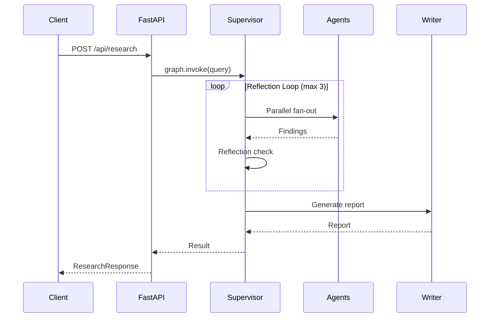

# API Documentation

AlphaResearch AI exposes a REST API via FastAPI for running equity research and company comparisons.

---

## Base URL

```
http://localhost:8000
```

---

## Endpoints

### `GET /health`

Health check endpoint.

**Response:**

```json
{
  "status": "healthy",
  "service": "alpha-research-ai"
}
```

**Status Codes:**

| Code | Description |
|:--|:--|
| `200` | Service is healthy |

---

### `POST /api/research`

Run autonomous equity research on a single company.

**Request Body:**

```json
{
  "query": "Analyze Apple Inc"
}
```

| Field | Type | Required | Description |
|:--|:--|:--|:--|
| `query` | `string` | Yes | Natural language research query |

**Supported Query Formats:**

| Format | Example |
|:--|:--|
| Company name | `"Analyze Apple Inc"` |
| Ticker symbol | `"Analyze AAPL"` |
| Name + ticker | `"Analyze Apple (AAPL)"` |
| Comparison | `"Compare Apple with Microsoft"` |
| Comparison (tickers) | `"AAPL vs MSFT"` |

**Response Body:**

```json
{
  "company": "Apple Inc",
  "ticker": "AAPL",
  "query_type": "single_stock",
  "report": "# Apple Inc (AAPL) — Equity Research Report\n\n## Executive Summary\n...",
  "sources": [
    "https://finance.yahoo.com/quote/AAPL",
    "https://www.reuters.com/technology/apple-..."
  ],
  "technical_analysis": {
    "analysis": "RSI: 62.4 (neutral), MACD: bullish crossover..."
  },
  "comparison_results": {},
  "status": "completed"
}
```

| Field | Type | Description |
|:--|:--|:--|
| `company` | `string` | Resolved company name |
| `ticker` | `string` | Stock ticker symbol |
| `query_type` | `string` | `"single_stock"` or `"comparison"` |
| `report` | `string` | Full Markdown research report |
| `sources` | `list[string]` | URLs cited in the report |
| `technical_analysis` | `dict` | Technical indicator results |
| `comparison_results` | `dict` | Comparison data (empty for single stock) |
| `status` | `string` | `"completed"` or `"failed"` |

**Status Codes:**

| Code | Description |
|:--|:--|
| `200` | Research completed successfully |
| `400` | Empty query |
| `499` | Request cancelled (client disconnect or server shutdown) |
| `500` | Research failed (see `detail` for error) |

**Error Response:**

```json
{
  "detail": "Research failed: <error message>"
}
```

---

### `POST /api/compare`

Run head-to-head comparison of two companies.

**Request Body:**

```json
{
  "company_a": "Apple Inc",
  "ticker_a": "AAPL",
  "company_b": "Microsoft",
  "ticker_b": "MSFT"
}
```

| Field | Type | Required | Description |
|:--|:--|:--|:--|
| `company_a` | `string` | Yes | First company name |
| `ticker_a` | `string` | Yes | First company ticker |
| `company_b` | `string` | Yes | Second company name |
| `ticker_b` | `string` | Yes | Second company ticker |

**Response Body:**

Same schema as `/api/research`, with `query_type: "comparison"` and `comparison_results` populated.

```json
{
  "company": "Apple Inc",
  "ticker": "AAPL",
  "query_type": "comparison",
  "report": "# Apple Inc vs Microsoft — Comparative Analysis\n...",
  "sources": ["..."],
  "technical_analysis": { "...": "..." },
  "comparison_results": {
    "analysis": "## Financial Comparison\n..."
  },
  "status": "completed"
}
```

**Status Codes:**

| Code | Description |
|:--|:--|
| `200` | Comparison completed successfully |
| `400` | Missing ticker symbols |
| `499` | Request cancelled (client disconnect or server shutdown) |
| `500` | Comparison failed |

---

## LangGraph Agent Server

In addition to the REST API, AlphaResearch AI exposes a LangGraph Agent Server for real-time streaming and Agent Chat UI integration.

### Start Server

```bash
langgraph dev
```

Server runs at `http://localhost:2024`.

### Configuration

```json
// langgraph.json
{
  "$schema": "https://langgra.ph/schema.json",
  "dependencies": ["."],
  "graphs": {
    "agent": "./graph.py:graph"
  },
  "env": ".env"
}
```

### Streaming

The Agent Server streams state updates automatically via `stream_mode`. The frontend receives real-time updates as agents execute.

### Human-in-the-Loop

The writer node uses `interrupt()` to pause execution and request user approval before generating the report. The Agent Chat UI surfaces the approval prompt.

---

## Data Flow



---

## Error Handling

All endpoints follow consistent error handling:

1. **Input validation** — Pydantic models validate request bodies
2. **CancelledError handling** — HTTP 499 returned on client disconnect or shutdown
3. **Graph execution** — LangGraph handles agent failures with retry policy
4. **Graceful degradation** — Agents return error messages instead of crashing
5. **Structured errors** — HTTP 500 with descriptive `detail` field

### Retry Policy

All agent nodes use exponential backoff retry:

| Parameter | Value |
|:--|:--|
| `max_attempts` | 3 |
| `initial_interval` | 1.0 seconds |
| `backoff_factor` | 2.0 (1s → 2s → 4s) |
| `retry_on` | Any exception |

---

## Authentication

Currently, no authentication is required. The API is designed for local development and internal use.

For production deployment, add:

- API key authentication
- Rate limiting
- CORS restrictions

---

## Rate Limits

| Endpoint | Limit | Notes |
|:--|:--|:--|
| `POST /api/research` | Depends on LLM providers | Subject to Gemini, Groq, OpenRouter limits |
| `POST /api/compare` | Depends on LLM providers | Same as research |
| `GET /health` | Unlimited | No LLM calls |

---

## OpenAPI Schema

FastAPI auto-generates OpenAPI docs:

```
http://localhost:8000/docs      # Swagger UI
http://localhost:8000/redoc     # ReDoc
```
