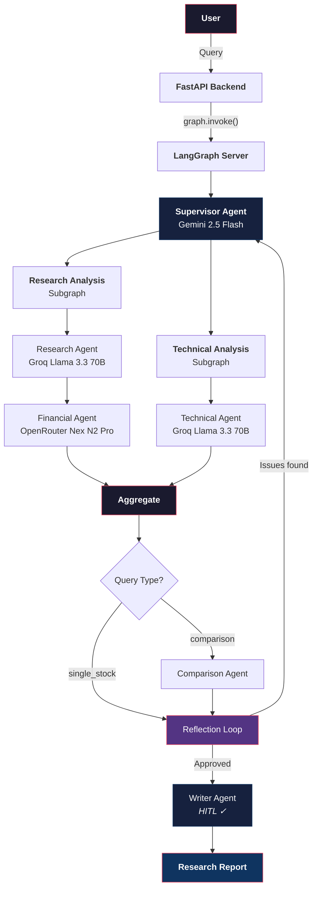
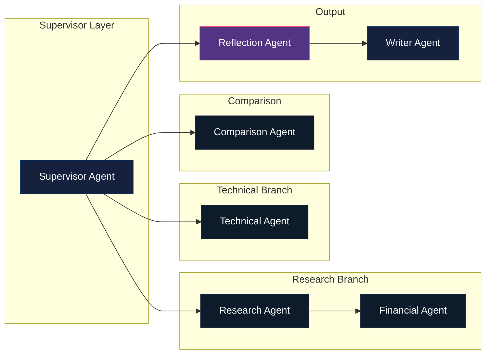
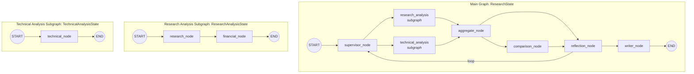
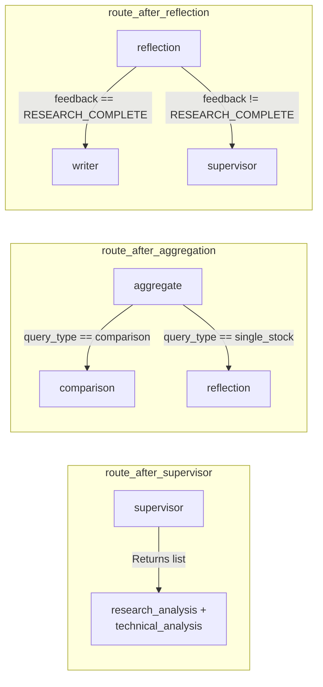
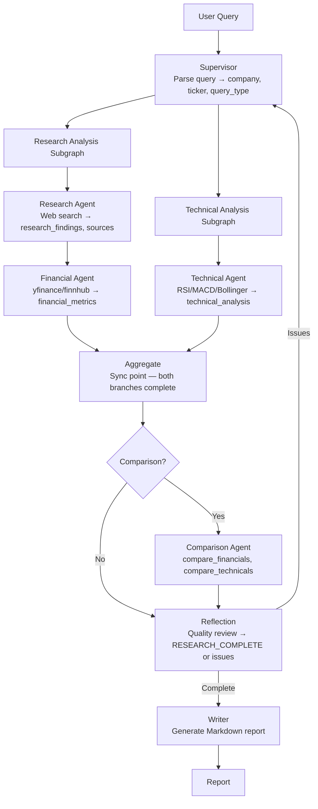
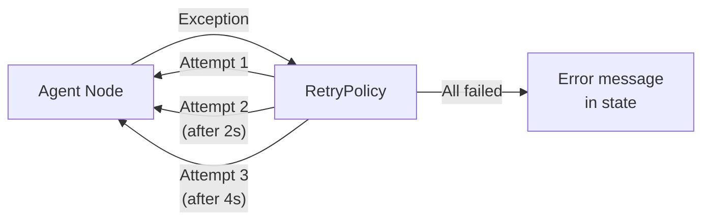
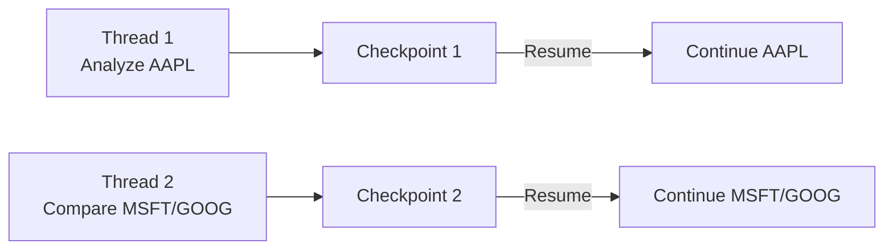
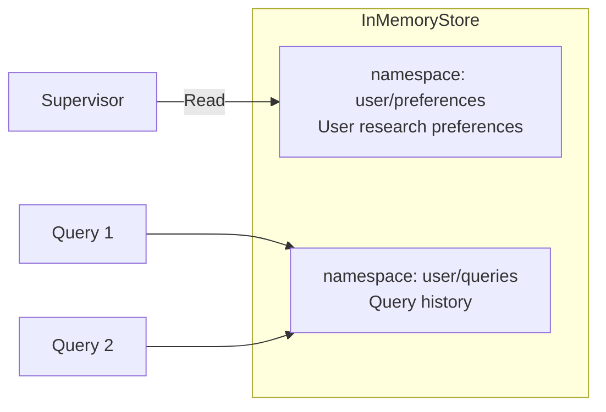
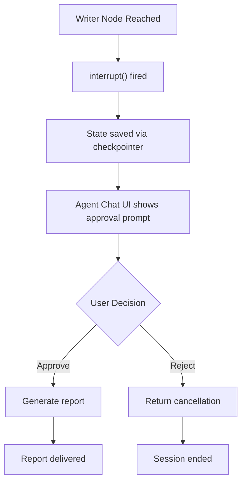

# Architecture Documentation

AlphaResearch AI is a multi-agent system built on LangGraph that orchestrates specialized AI agents to perform autonomous equity research.

---

## High-Level Architecture

---

## Agent Architecture

The system follows a **Supervisor Pattern** — only the supervisor communicates with users, all other agents are specialist workers.

### Agent Hierarchy

### Agent Responsibilities

| Agent | Model | Role | Tools |
|:--|:--|:--|:--|
| **Supervisor** | Gemini 2.5 Flash | Query parsing, orchestration | None (LLM only) |
| **Research** | Groq Llama 3.3 70B | Web intelligence gathering | All search tools |
| **Financial** | OpenRouter Nex N2 Pro | Fundamental analysis | Yahoo Finance, Finnhub, Alpha Vantage |
| **Technical** | Groq Llama 3.3 70B | Technical indicators | RSI, MACD, Bollinger, support/resistance |
| **Comparison** | Gemini 2.5 Flash | Head-to-head analysis | All comparison tools |
| **Reflection** | Gemini 2.5 Flash | Quality review | None (LLM only) |
| **Writer** | Gemini 2.5 Flash | Report generation | None (LLM only) |

---

## LangGraph Graph Structure

### Node Definitions

### Conditional Edges

---

## State Schema

### ResearchState (Main Graph)

```mermaid
flowchart LR
    subgraph "ResearchState"
        direction TB
        M["messages: Annotated[list, add_messages]"]
        UQ["user_query: str"]
        C["company: str"]
        T["ticker: str"]
        QT["query_type: str"]
        RF["research_findings: str"]
        FM["financial_metrics: dict"]
        TA["technical_analysis: dict"]
        CR["comparison_results: dict"]
        VR["valuation_results: dict"]
        RR["risk_results: dict"]
        S["sources: list[str]"]
        FR["final_report: str"]
        RFB["reflection_feedback: str"]
        CC["cycle_count: int"]
        TC["target_companies: list[dict]"]
    end
```

### Subgraph State Mapping

| Subgraph | Shared Keys (auto-mapped) | Private Keys |
|:--|:--|:--|
| `research_analysis` | `company`, `ticker`, `research_findings`, `financial_metrics`, `sources` | None |
| `technical_analysis` | `company`, `ticker`, `technical_analysis` | None |

When a subgraph is added via `add_node()`, LangGraph automatically maps shared keys between the subgraph state and the parent graph state.

---

## Data Flow

---

## Fault Tolerance

### Retry Policy

All agent nodes use `RetryPolicy` from LangGraph:

| Parameter | Value |
|:--|:--|
| `max_attempts` | 3 |
| `initial_interval` | 1.0s |
| `backoff_factor` | 2.0 |
| `retry_on` | `Exception` (all) |

### Graceful Degradation

When an agent fails after all retries:

1. **Research agent** → Returns `"Research failed: <error>"` + empty sources
2. **Financial agent** → Returns `{"error": "<message>"}` in `financial_metrics`
3. **Technical agent** → Returns `{"error": "<message>"}` in `technical_analysis`
4. **Supervisor** → Falls back to default query parsing (no LLM)
5. **Reflection** → Uses basic completeness checks instead of LLM review
6. **Writer** → Returns `"Report generation failed: <error>"`

---

## Persistence & Memory

### Per-Thread Checkpointing (MemorySaver)

Each research session gets a unique `thread_id`. `MemorySaver` checkpoints state at every superstep, enabling:

- Session resume after interruptions
- Human-in-the-loop approval flow
- Debug state at any point

### Cross-Thread Memory (InMemoryStore)

| Namespace | Purpose | Access |
|:--|:--|:--|
| `("user", "preferences")` | User research preferences | Read at supervisor startup |
| `("user", "queries")` | Query history | Write on every query |

---

## Human-in-the-Loop

The `interrupt()` function pauses graph execution and surfaces to the frontend. The user can approve or reject report generation.

---

## Technology Stack

| Layer | Technology | Purpose |
|:--|:--|:--|
| **Agent Framework** | LangGraph | Graph orchestration, state management |
| **Agent Library** | DeepAgents | Autonomous research agents |
| **Model Routing** | LiteLLM | Unified LLM access across providers |
| **Backend** | FastAPI | REST API |
| **Frontend** | Agent Chat UI | Real-time streaming interface |
| **Vector DB** | ChromaDB | RAG pipeline (Phase 4) |
| **Observability** | LangSmith | Tracing, monitoring |
