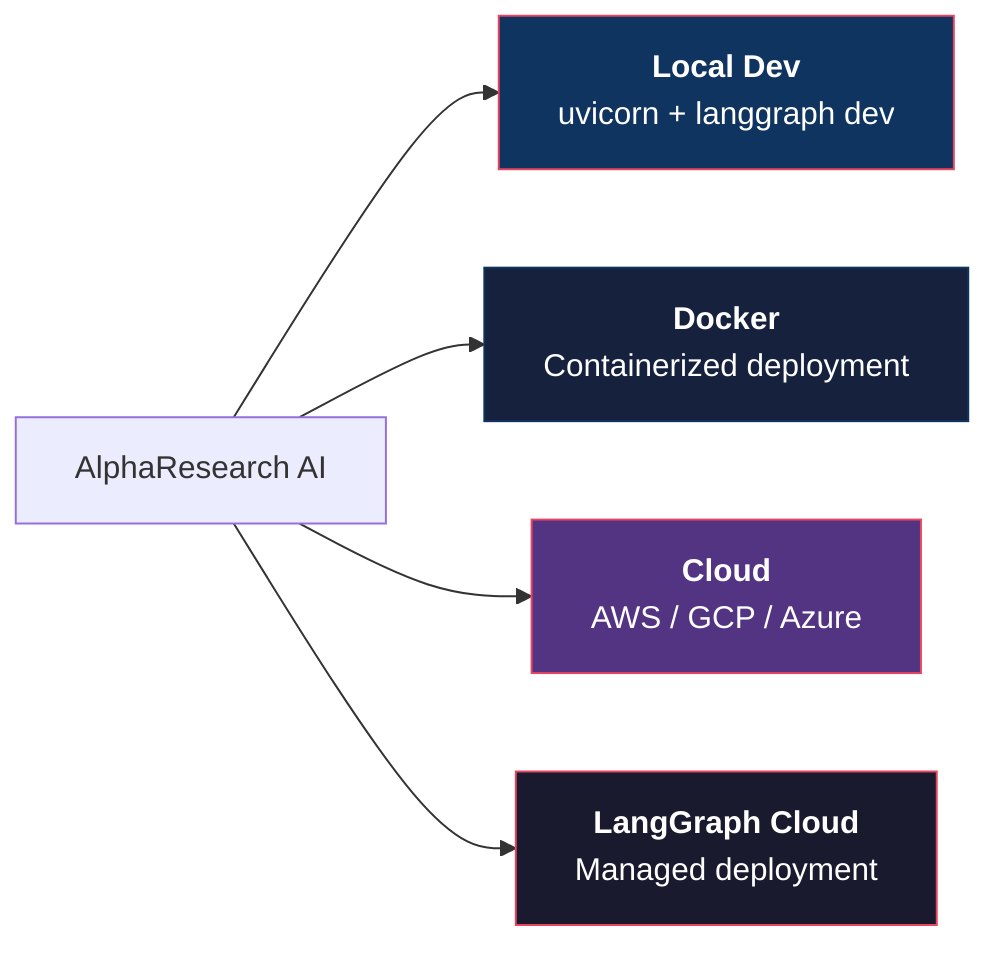
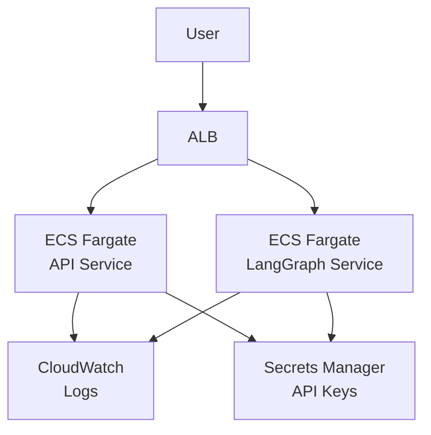

# Deployment Guide

Step-by-step guide for deploying AlphaResearch AI to production.

---

## Deployment Options



---

## 1. Local Development

### Prerequisites

- Python 3.11+
- [uv](https://docs.astral.sh/uv/) (recommended) or pip
- Git

### Setup

```bash
# Clone
git clone https://github.com/himanshu231204/AlphaResearch-AI.git
cd AlphaResearch-AI

# Install
uv sync

# Configure
cp env.example .env
# Edit .env with your API keys

# Test
pytest tests/ -v
```

### Run Services

**Terminal 1 — FastAPI Backend:**
```bash
uvicorn app.main:app --reload --host 0.0.0.0 --port 8000
```

**Terminal 2 — LangGraph Server:**
```bash
langgraph dev
```

**Terminal 3 — Frontend (optional):**
```bash
cd frontend
npm install
npm run dev
```

### Service Ports

| Service | URL | Purpose |
|:--|:--|:--|
| FastAPI | `http://localhost:8000` | REST API |
| LangGraph Server | `http://localhost:2024` | Agent streaming |
| Agent Chat UI | `http://localhost:3000` | Frontend |
| Swagger Docs | `http://localhost:8000/docs` | API documentation |

---

## 2. Docker Deployment

### Dockerfile

```dockerfile
FROM python:3.11-slim

WORKDIR /app

# Install system dependencies
RUN apt-get update && apt-get install -y --no-install-recommends \
    build-essential \
    && rm -rf /var/lib/apt/lists/*

# Install Python dependencies
COPY pyproject.toml .
RUN pip install --no-cache-dir -e "."

# Copy application code
COPY . .

# Expose ports
EXPOSE 8000 2024

# Run both services
CMD ["sh", "-c", "uvicorn app.main:app --host 0.0.0.0 --port 8000 & langgraph dev --host 0.0.0.0 --port 2024"]
```

### Docker Compose

```yaml
version: "3.8"

services:
  api:
    build: .
    ports:
      - "8000:8000"
    env_file: .env
    healthcheck:
      test: ["CMD", "curl", "-f", "http://localhost:8000/health"]
      interval: 30s
      timeout: 10s
      retries: 3

  langgraph:
    build: .
    ports:
      - "2024:2024"
    env_file: .env
    command: langgraph dev --host 0.0.0.0 --port 2024
    healthcheck:
      test: ["CMD", "curl", "-f", "http://localhost:2024/health"]
      interval: 30s
      timeout: 10s
      retries: 3

  frontend:
    build: ./frontend
    ports:
      - "3000:3000"
    environment:
      - NEXT_PUBLIC_LANGGRAPH_URL=http://langgraph:2024
    depends_on:
      - langgraph
```

### Run with Docker Compose

```bash
# Build and start
docker-compose up -d

# View logs
docker-compose logs -f

# Stop
docker-compose down
```

---

## 3. Cloud Deployment

### AWS (ECS Fargate)



**Steps:**

1. Push Docker image to ECR
2. Create ECS cluster with Fargate
3. Create task definitions for API and LangGraph
4. Store API keys in Secrets Manager
5. Configure ALB for routing
6. Set up CloudWatch for logs

### GCP (Cloud Run)

```bash
# Build and push
gcloud builds submit --tag gcr.io/PROJECT_ID/alpha-research-ai

# Deploy API
gcloud run deploy alpha-research-api \
  --image gcr.io/PROJECT_ID/alpha-research-ai \
  --port 8000 \
  --allow-unauthenticated

# Deploy LangGraph
gcloud run deploy alpha-research-langgraph \
  --image gcr.io/PROJECT_ID/alpha-research-ai \
  --port 2024 \
  --command langgraph dev
```

### Azure (Container Apps)

```bash
az containerapp up \
  --name alpha-research-api \
  --image alpha-research-ai:latest \
  --target-port 8000 \
  --env-vars "GEMINI_API_KEY=xxx"
```

---

## 4. LangGraph Cloud (Managed)

The simplest production option — LangGraph handles infrastructure.

### Steps

1. Push code to GitHub
2. Connect repo to [LangGraph Cloud](https://smith.langchain.com)
3. Configure environment variables in dashboard
4. Deploy — LangGraph manages scaling, persistence, monitoring

### Benefits

- Auto-scaling
- Managed persistence
- Built-in monitoring
- No infrastructure management

---

## Environment Configuration

### Required Variables

| Variable | Description | How to Get |
|:--|:--|:--|
| `GEMINI_API_KEY` | Google Gemini API key | [aistudio.google.com/apikey](https://aistudio.google.com/apikey) |
| `GROQ_API_KEY` | Groq API key | [console.groq.com](https://console.groq.com) |
| `OPENROUTER_API_KEY` | OpenRouter API key | [openrouter.ai/keys](https://openrouter.ai/keys) |

### Optional Variables

| Variable | Description | Default |
|:--|:--|:--|
| `FINNHUB_API_KEY` | Finnhub financial data | Empty (disabled) |
| `ALPHA_VANTAGE_API_KEY` | Alpha Vantage data | Empty (disabled) |
| `TAVILY_API_KEY` | Tavily search | Empty (disabled) |
| `LANGSMITH_API_KEY` | LangSmith tracing | Empty (disabled) |
| `LANGSMITH_TRACING` | Enable tracing | `true` |

### Production `.env` Template

```env
# LLM Providers (required)
GEMINI_API_KEY=your_key_here
GROQ_API_KEY=your_key_here
OPENROUTER_API_KEY=your_key_here

# Financial Data (optional)
FINNHUB_API_KEY=your_key_here
ALPHA_VANTAGE_API_KEY=your_key_here

# Search (optional)
TAVILY_API_KEY=your_key_here

# Observability (recommended)
LANGSMITH_API_KEY=your_key_here
LANGSMITH_TRACING=true
LANGSMITH_PROJECT=alpha-research-ai-production
```

---

## Health Checks

### API Health Check

```bash
curl http://localhost:8000/health
```

Expected response:
```json
{"status": "healthy", "service": "alpha-research-ai"}
```

### LangGraph Health Check

```bash
curl http://localhost:2024/health
```

---

## Monitoring

### LangSmith Dashboard

Access at [smith.langchain.com](https://smith.langchain.com):

- Agent execution traces
- Token usage per model
- Latency metrics
- Error rates
- Cost tracking

### Key Metrics to Monitor

| Metric | Alert Threshold |
|:--|:--|
| API response time | > 5 seconds |
| Agent completion rate | < 90% |
| Model error rate | > 5% |
| Token usage spike | > 2x normal |

---

## Scaling Considerations

| Component | Scaling Strategy |
|:--|:--|
| FastAPI | Horizontal (multiple workers) |
| LangGraph Server | Horizontal (stateless) |
| ChromaDB | Vertical (single node) or Chroma Cloud |
| LLM calls | Rate limit aware, queue-based |

### Rate Limit Handling

| Provider | Free Tier Limit | Production Consideration |
|:--|:--|:--|
| Gemini | 15 RPM | Upgrade to paid tier |
| Groq | 30 RPM | Upgrade to paid tier |
| OpenRouter | Varies | Pay-per-use available |

---

## Security Checklist

- [ ] API keys stored in environment variables (not code)
- [ ] `.env` file not committed to git
- [ ] CORS configured for production domains only
- [ ] Rate limiting enabled on API endpoints
- [ ] HTTPS enabled for all external connections
- [ ] API authentication added for production
- [ ] Secrets rotated regularly
- [ ] Logs do not contain sensitive data
