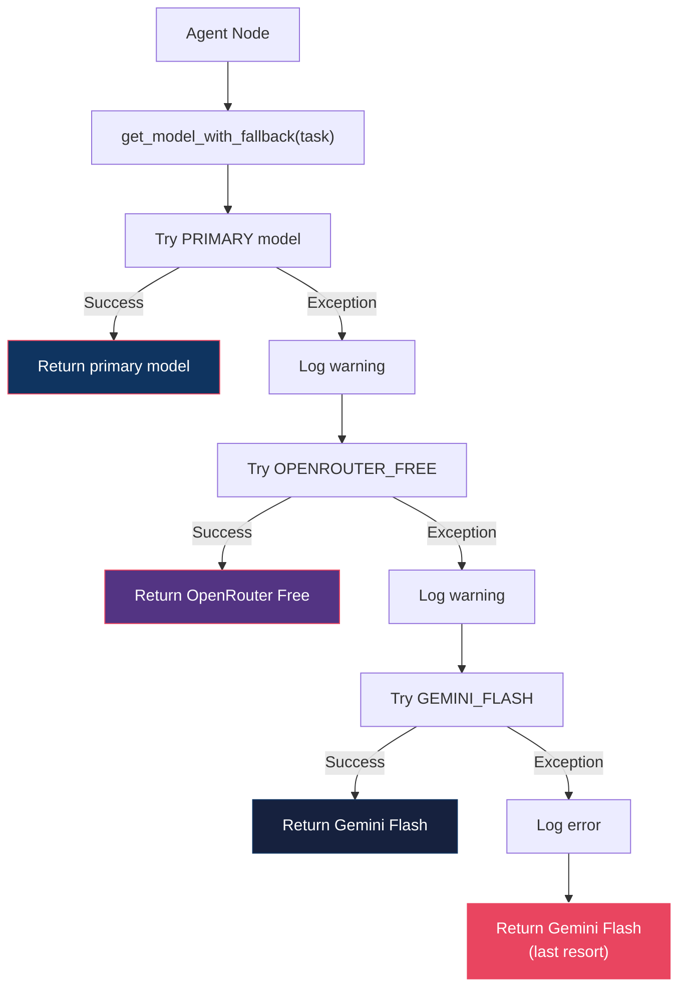
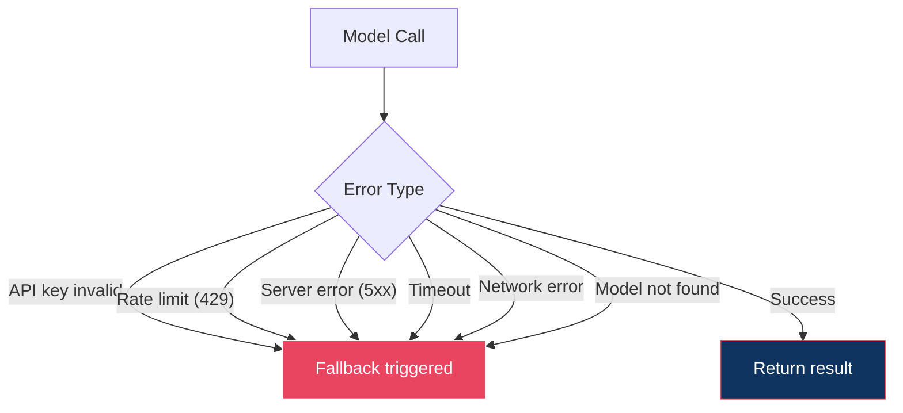
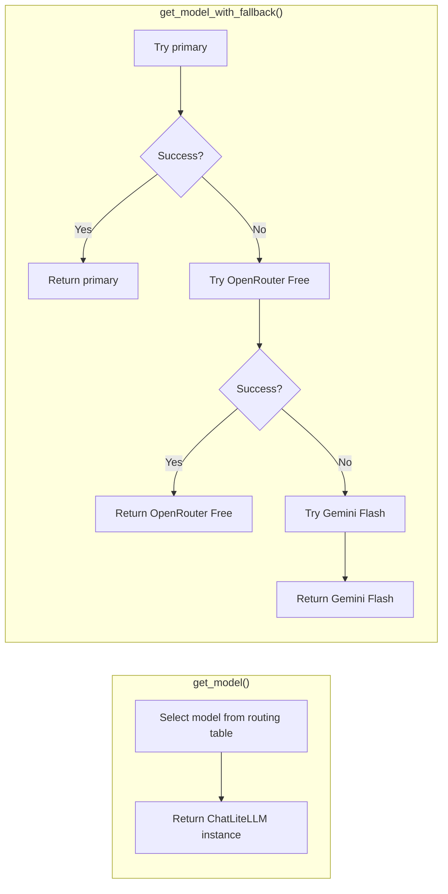
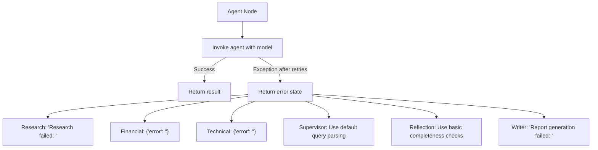
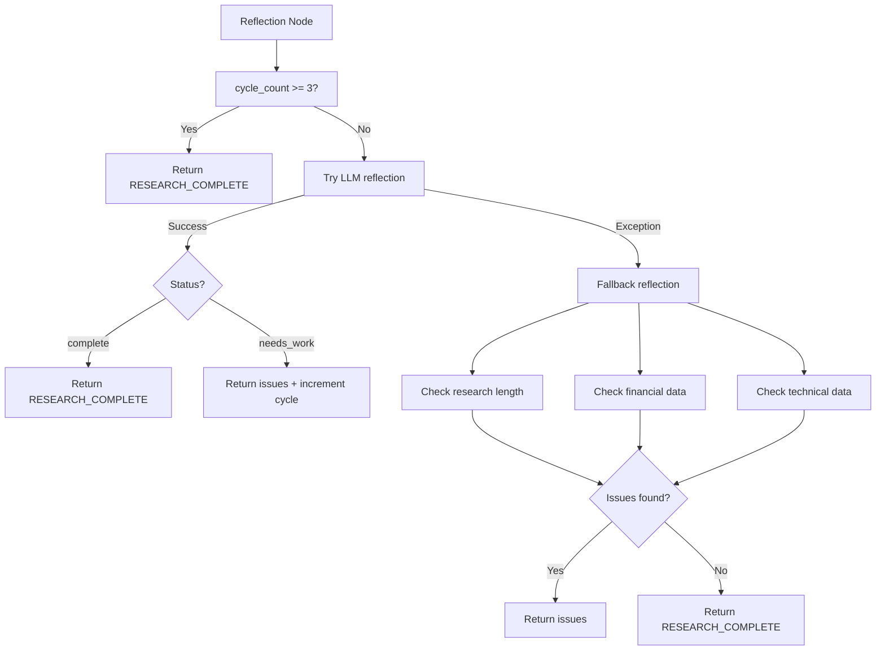
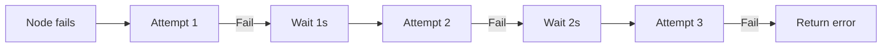

# Model Fallback Documentation

AlphaResearch AI implements a multi-layer fallback strategy to ensure reliability when LLM providers are unavailable, rate-limited, or returning errors.

---

## Fallback Architecture



---

## Fallback Chain

### Priority Order

| Priority | Model | Provider | Rationale |
|:--|:--|:--|:--|
| 1 (Primary) | Task-specific model | Varies | Best model for the task |
| 2 | `meta-llama/llama-3.3-70b-instruct:free` | OpenRouter | Free, reliable, general-purpose |
| 3 | `gemini/gemini-2.5-flash` | Google | Free tier, high quality |

### Per-Task Primary Models

| Task | Primary | Fallback 1 | Fallback 2 |
|:--|:--|:--|:--|
| `planning` | Gemini 2.5 Flash | OpenRouter Free | Gemini Flash |
| `reflection` | Gemini 2.5 Flash | OpenRouter Free | Gemini Flash |
| `report_writing` | Gemini 2.5 Flash | OpenRouter Free | Gemini Flash |
| `financial_analysis` | OpenRouter Nex | OpenRouter Free | Gemini Flash |
| `research` | Groq Llama 3.3 70B | OpenRouter Free | Gemini Flash |
| `technical_analysis` | Groq Llama 3.3 70B | OpenRouter Free | Gemini Flash |
| `quick_summary` | Groq Llama 3.3 70B | OpenRouter Free | Gemini Flash |

---

## Fallback Triggers

### What Causes Fallback



### Common Failure Scenarios

| Scenario | Error | Fallback Action |
|:--|:--|:--|
| Gemini API key expired | `Invalid API key` | Try OpenRouter Free → Gemini Flash |
| Groq rate limit | `429 Too Many Requests` | Try OpenRouter Free → Gemini Flash |
| OpenRouter down | `503 Service Unavailable` | Try Gemini Flash |
| Network timeout | `ConnectTimeout` | Try next in chain |
| Model deprecated | `Model not found` | Try next in chain |

---

## Fallback Implementation

### Two Functions



| Function | Use Case | When to Use |
|:--|:--|:--|
| `get_model()` | Simple, fast selection | Non-critical tasks, testing |
| `get_model_with_fallback()` | Reliable selection with failover | Production agent nodes |

### Code Flow

```python
# get_model_with_fallback implementation
def get_model_with_fallback(task, temperature):
    primary = MODEL_ROUTING.get(task, DEFAULT_MODEL)
    
    # Step 1: Try primary
    try:
        return ChatLiteLLM(model=primary, temperature=temperature)
    except Exception as e:
        logger.warning(f"Primary {primary} failed: {e}")
    
    # Step 2: Try fallback chain
    for fallback in FALLBACK_MODELS:
        try:
            return ChatLiteLLM(model=fallback, temperature=temperature)
        except Exception as e:
            logger.warning(f"Fallback {fallback} failed: {e}")
    
    # Step 3: Last resort
    return ChatLiteLLM(model=GEMINI_FLASH, temperature=temperature)
```

---

## Agent-Level Fallback

Beyond model routing, each agent has its own fallback behavior:



### Agent Fallback Behaviors

| Agent | Fallback Behavior |
|:--|:--|
| **Supervisor** | Falls back to regex-based query parsing (no LLM) |
| **Research** | Returns error string + empty sources list |
| **Financial** | Returns `{"error": "..."}` in `financial_metrics` |
| **Technical** | Returns `{"error": "..."}` in `technical_analysis` |
| **Comparison** | Returns `{"error": "..."}` in `comparison_results` |
| **Reflection** | Uses basic length/completeness checks instead of LLM |
| **Writer** | Returns error message instead of report |

---

## Reflection Fallback

The reflection agent has a two-tier fallback:



### Fallback Reflection Checks

| Check | Condition | Issue |
|:--|:--|:--|
| Research findings | `< 100 chars` or empty | "Research findings are too brief or missing" |
| Financial metrics | Empty or contains `"error"` | "Financial analysis is missing or contains errors" |
| Technical analysis | Empty or contains `"error"` | "Technical analysis is missing or contains errors" |
| Comparison results | Empty or contains `"error"` | "Comparison results are missing or contain errors" |

---

## Retry Policy

All agent nodes use LangGraph's `RetryPolicy`:



| Parameter | Value |
|:--|:--|
| `max_attempts` | 3 |
| `initial_interval` | 1.0 second |
| `backoff_factor` | 2.0 |
| `retry_on` | `Exception` |

---

## Monitoring Fallbacks

### Log Messages

```
WARNING: Primary model groq/llama-3.3-70b-versatile failed for 'research': Rate limit exceeded
INFO: Trying fallback model openrouter/meta-llama/llama-3.3-70b-instruct:free for task 'research'
WARNING: Fallback model openrouter/meta-llama/llama-3.3-70b-instruct:free also failed for 'research': Timeout
ERROR: All models failed for task 'research', using Gemini Flash
```

### LangSmith Traces

Each model call is traced in LangSmith with:
- Model name attempted
- Success/failure status
- Error message
- Latency
- Token usage

---

## Cost Implications

All fallback models are free:

| Model | Provider | Cost |
|:--|:--|:--|
| Gemini 2.5 Flash | Google | Free tier |
| Groq Llama 3.3 70B | Groq | Free tier |
| OpenRouter Nex | OpenRouter | Free |
| OpenRouter Free | OpenRouter | Free |

**Fallback does not incur additional costs.**

---

## Testing Fallback

### Unit Test Pattern

```python
from unittest.mock import patch, MagicMock
from models.routing import get_model_with_fallback

def test_fallback_to_openrouter_free():
    with patch("models.routing.ChatLiteLLM") as mock_llm:
        # First call (primary) fails
        mock_llm.side_effect = [
            Exception("Primary failed"),
            MagicMock(),  # Fallback succeeds
        ]
        
        model = get_model_with_fallback("research")
        assert mock_llm.call_count == 2
```

### Integration Test

```python
def test_all_models_reachable():
    """Verify at least one model in the fallback chain is available."""
    from models.routing import get_model_with_fallback
    
    model = get_model_with_fallback("planning")
    assert model is not None
    
    # Should not raise
    result = model.invoke("Hello")
    assert result is not None
```
