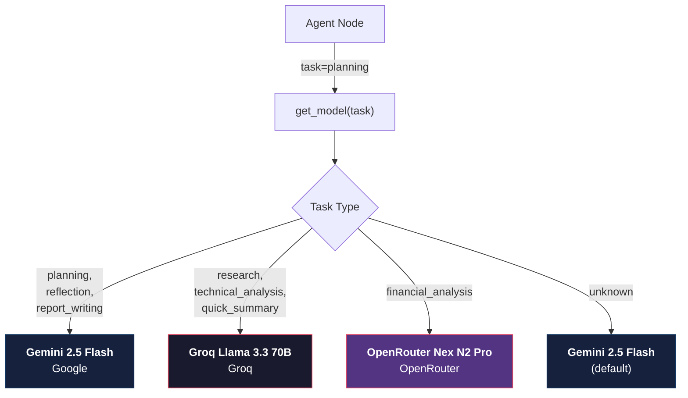
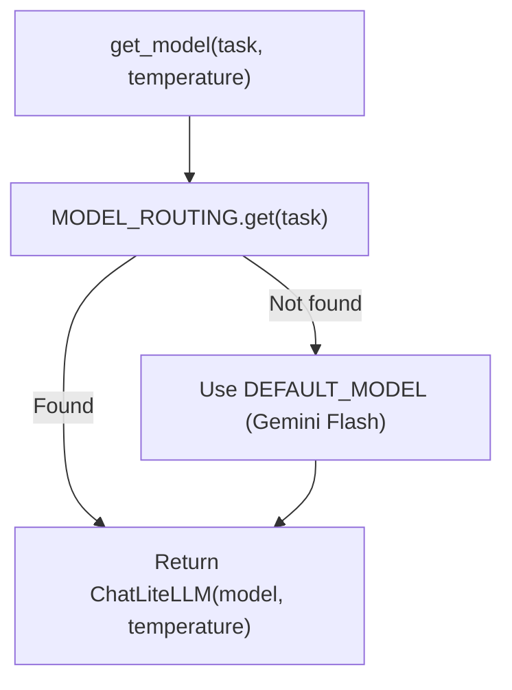
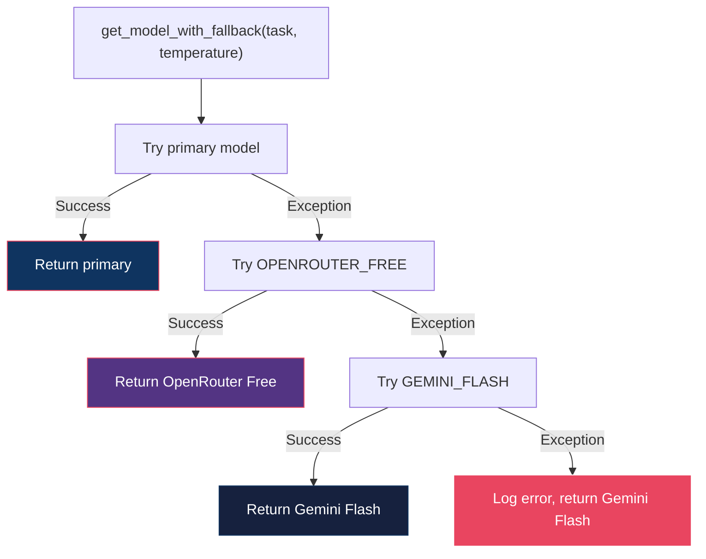

# Model Routing Documentation

AlphaResearch AI routes LLM calls through LiteLLM, selecting the optimal model for each task based on capability, speed, and cost.

---

## Routing Architecture



---

## Model Definitions

| Alias | Model String | Provider | Cost |
|:--|:--|:--|:--|
| `GEMINI_FLASH` | `gemini/gemini-2.5-flash` | Google | Free tier |
| `GROQ_LLAMA` | `groq/llama-3.3-70b-versatile` | Groq | Free tier |
| `OPENROUTER_NEX` | `openrouter/nex-agi/nex-n2-pro:free` | OpenRouter | Free |
| `OPENROUTER_FREE` | `openrouter/meta-llama/llama-3.3-70b-instruct:free` | OpenRouter | Free |

---

## Task → Model Mapping

| Task | Model | Why |
|:--|:--|:--|
| `planning` | Gemini 2.5 Flash | Best reasoning for query parsing and structured output |
| `reflection` | Gemini 2.5 Flash | Strong analytical capability for quality review |
| `report_writing` | Gemini 2.5 Flash | High-quality generation for research reports |
| `financial_analysis` | OpenRouter Nex N2 Pro | Free, specialized for financial tasks |
| `research` | Groq Llama 3.3 70B | Fast inference for web research summarization |
| `technical_analysis` | Groq Llama 3.3 70B | Fast processing for indicator calculations |
| `quick_summary` | Groq Llama 3.3 70B | Low-latency for quick summaries |

---

## Routing Logic

### Primary Selection



### Fallback Chain



### Fallback Priority

1. **Primary model** — task-specific model from `MODEL_ROUTING`
2. **OpenRouter Free** — `meta-llama/llama-3.3-70b-instruct:free`
3. **Gemini Flash** — `gemini/gemini-2.5-flash` (last resort)

---

## Provider Configuration

### Google (Gemini)

| Setting | Value |
|:--|:--|
| API Key env var | `GEMINI_API_KEY` |
| Provider package | `langchain-google-genai` |
| Models | `gemini-2.5-flash` |

### Groq

| Setting | Value |
|:--|:--|
| API Key env var | `GROQ_API_KEY` |
| Provider package | `langchain-litellm` |
| Models | `llama-3.3-70b-versatile` |

### OpenRouter

| Setting | Value |
|:--|:--|
| API Key env var | `OPENROUTER_API_KEY` |
| Provider package | `langchain-litellm` |
| Models | `nex-agi/nex-n2-pro:free`, `meta-llama/llama-3.3-70b-instruct:free` |

---

## Temperature Settings

| Task | Temperature | Rationale |
|:--|:--|:--|
| `planning` | 0.0 | Deterministic query parsing |
| `reflection` | 0.0 | Consistent quality checks |
| `report_writing` | 0.7 | Balanced creativity and accuracy |
| `financial_analysis` | 0.3 | Mostly deterministic, slight variation |
| `research` | 0.5 | Balanced exploration |
| `technical_analysis` | 0.3 | Data-driven, low creativity |
| `quick_summary` | 0.5 | Balanced |

---

## API Usage

### Basic Usage

```python
from models.routing import get_model

# Get model for planning task
model = get_model(task="planning", temperature=0.0)

# Use with LangChain
result = model.invoke([SystemMessage(content="..."), HumanMessage(content="...")])
```

### With Fallback

```python
from models.routing import get_model_with_fallback

# Get model with automatic fallback chain
model = get_model_with_fallback(task="financial_analysis")
result = model.invoke(messages)
```

### Structured Output

```python
from models.routing import get_model
from pydantic import BaseModel

class QueryPlan(BaseModel):
    query_type: str
    company: str
    ticker: str

model = get_model(task="planning")
parser = model.with_structured_output(QueryPlan)
plan = parser.invoke([SystemMessage(content="..."), HumanMessage(content="...")])
```

---

## Cost Analysis

### Per-Query Cost Estimate

| Task | Model | Cost per 1K tokens |
|:--|:--|:--|
| Planning | Gemini 2.5 Flash | ~$0.00 (free tier) |
| Research | Groq Llama 3.3 70B | ~$0.00 (free tier) |
| Financial | OpenRouter Nex | ~$0.00 (free) |
| Technical | Groq Llama 3.3 70B | ~$0.00 (free tier) |
| Reflection | Gemini 2.5 Flash | ~$0.00 (free tier) |
| Writing | Gemini 2.5 Flash | ~$0.00 (free tier) |

**Total per research query: ~$0.00** (all free tier/free models)

### Free Tier Limits

| Provider | Limit | Resets |
|:--|:--|:--|
| Google Gemini | 15 RPM, 1M tokens/day | Daily |
| Groq | 30 RPM, 13K tokens/min | Per minute |
| OpenRouter Free | Varies by model | Per request |

---

## Adding New Models

To add a new model to the routing system:

```python
# 1. Add alias
NEW_MODEL = "provider/model-name"

# 2. Add to routing table
MODEL_ROUTING["new_task"] = NEW_MODEL

# 3. Optionally add to fallback chain
FALLBACK_MODELS = [OPENROUTER_FREE, GEMINI_FLASH, NEW_MODEL]
```

---

## Monitoring

Track model usage via LangSmith:

```env
LANGSMITH_API_KEY=your_key
LANGSMITH_TRACING=true
LANGSMITH_PROJECT=alpha-research-ai
```

LangSmith traces include:
- Which model was called
- Token usage per call
- Latency per model
- Error rates
