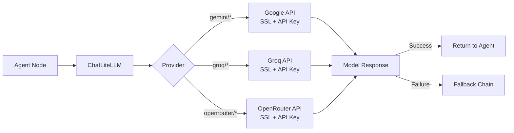
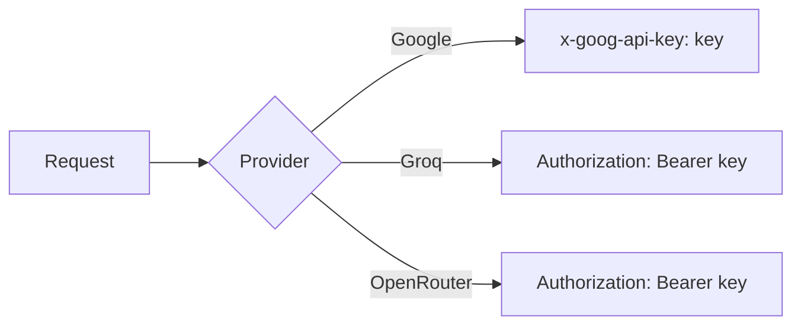
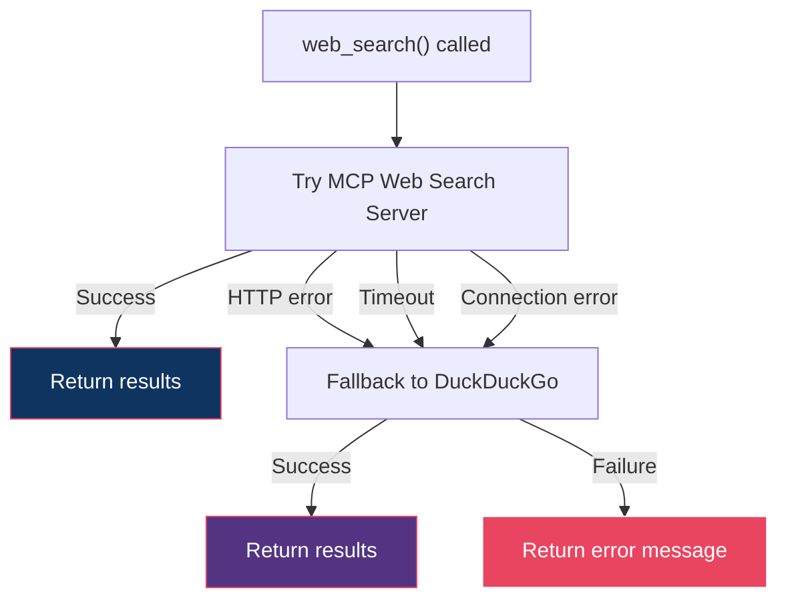
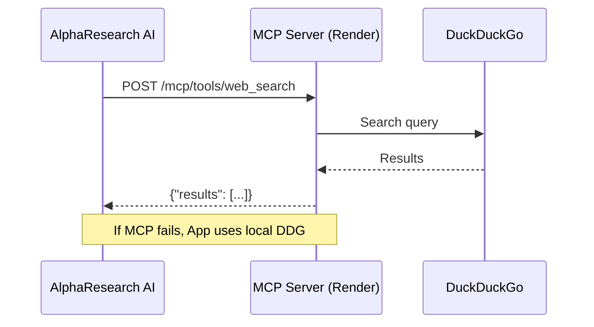
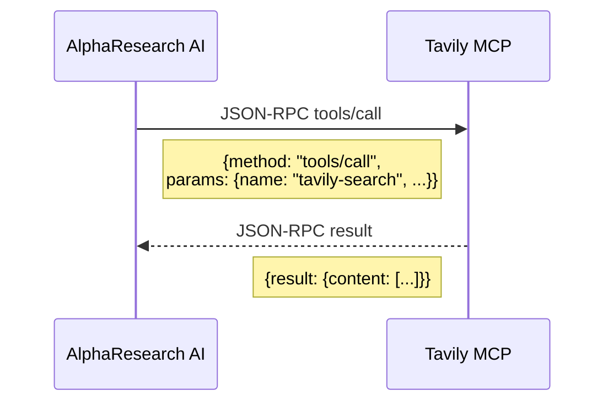
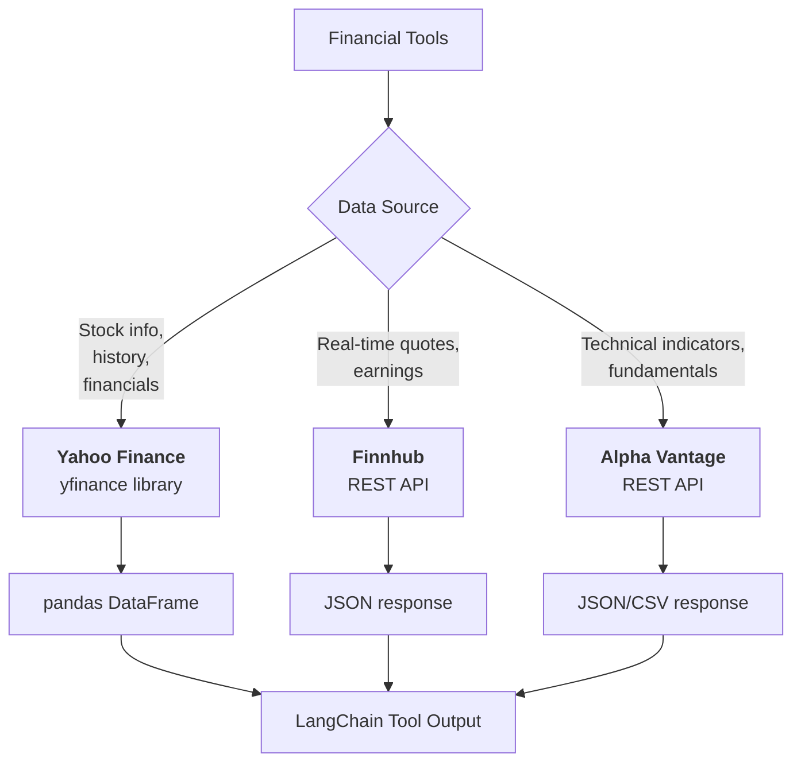
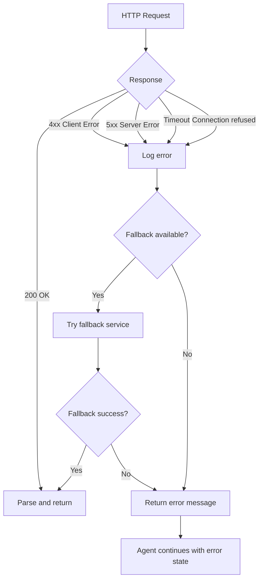
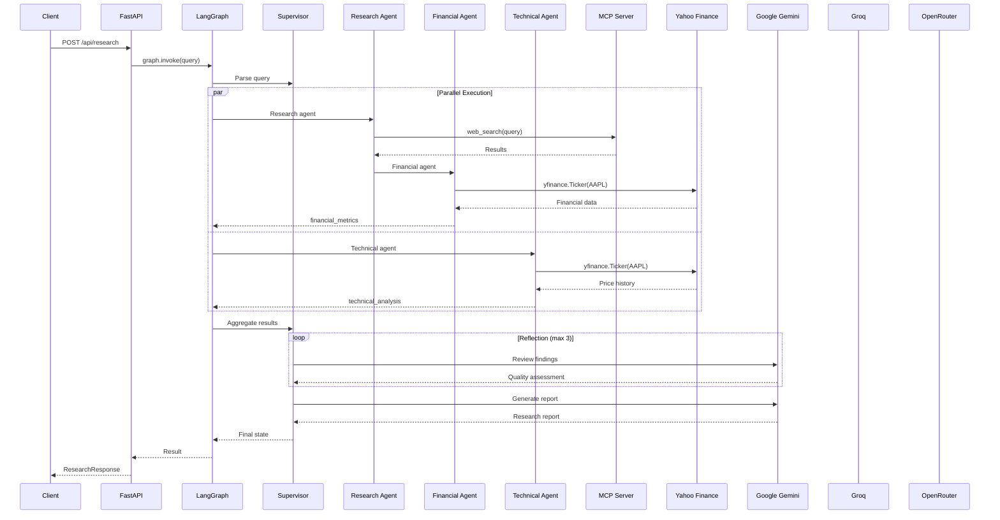

# Network Routing Documentation

AlphaResearch AI connects to multiple external services for LLM inference, web search, and financial data. This document describes the network topology, connection flows, and fallback mechanisms.

---

## Network Topology

```mermaid
flowchart TD
    subgraph "Local System"
        APP["<b>AlphaResearch AI</b><br/>FastAPI + LangGraph"]
    end

    subgraph "LLM Providers"
        GEMINI["<b>Google Gemini</b><br/>generativelanguage.googleapis.com"]
        GROQ["<b>Groq</b><br/>api.groq.com"]
        OR["<b>OpenRouter</b><br/>openrouter.ai/api"]
    end

    subgraph "Search Services"
        MCP["<b>MCP Web Search</b><br/>mcp-web-search-nwgd.onrender.com"]
        TAVILY["<b>Tavily MCP</b><br/>mcp.tavily.com"]
        DDG["<b>DuckDuckGo</b><br/>(local ddgs library)"]
        GOOGLE_S["<b>Google Search</b><br/>googleapis.com"]
        BRAVE["<b>Brave Search</b><br/>api.search.brave.com"]
    end

    subgraph "Financial Data"
        YF["<b>Yahoo Finance</b><br/>query1.finance.yahoo.com"]
        FH["<b>Finnhub</b><br/>finnhub.io"]
        AV["<b>Alpha Vantage</b><br/>alphavantage.co"]
    end

    subgraph "Observability"
        LS["<b>LangSmith</b><br/>api.smith.langchain.com"]
    end

    APP -->|"HTTP/REST"| GEMINI
    APP -->|"HTTP/REST"| GROQ
    APP -->|"HTTP/REST"| OR
    APP -->|"HTTP/REST"| MCP
    APP -->|"JSON-RPC"| TAVILY
    APP -->|"Python lib"| DDG
    APP -->|"HTTP/REST"| GOOGLE_S
    APP -->|"HTTP/REST"| BRAVE
    APP -->|"Python lib"| YF
    APP -->|"HTTP/REST"| FH
    APP -->|"HTTP/REST"| AV
    APP -->|"HTTP/REST"| LS

    style APP fill:#16213e,stroke:#0f3460,color:#fff
    style GEMINI fill:#0d1b2a,stroke:#1b263b,color:#fff
    style GROQ fill:#0d1b2a,stroke:#1b263b,color:#fff
    style OR fill:#0d1b2a,stroke:#1b263b,color:#fff
    style MCP fill:#533483,stroke:#e94560,color:#fff
    style TAVILY fill:#533483,stroke:#e94560,color:#fff
    style DDG fill:#1a1a2e,stroke:#e94560,color:#fff
    style YF fill:#0f3460,stroke:#e94560,color:#fff
    style FH fill:#0f3460,stroke:#e94560,color:#fff
    style AV fill:#0f3460,stroke:#e94560,color:#fff
    style LS fill:#1a1a2e,stroke:#e94560,color:#fff
```

---

## LLM Provider Routing

### Connection Flow

### Provider Endpoints

| Provider | Base URL | Auth | Protocol |
|:--|:--|:--|:--|
| Google Gemini | `https://generativelanguage.googleapis.com/v1beta/` | API Key (header) | HTTPS REST |
| Groq | `https://api.groq.com/openai/v1/` | API Key (Bearer) | HTTPS REST |
| OpenRouter | `https://openrouter.ai/api/v1/` | API Key (Bearer) | HTTPS REST |

### Authentication

---

## Search Service Routing

### Search Priority Chain

### Search Tool Network Paths

| Tool | Endpoint | Protocol | Auth | Fallback |
|:--|:--|:--|:--|:--|
| `web_search` | `mcp-web-search-nwgd.onrender.com/mcp` | HTTPS REST | None | DuckDuckGo |
| `fetch_web_page` | `mcp-web-search-nwgd.onrender.com/mcp` | HTTPS REST | None | Error message |
| `duckduckgo_search` | Local `ddgs` library | N/A (local) | None | Error message |
| `tavily_search` | `mcp.tavily.com/mcp` | JSON-RPC | API Key (query param) | Error message |
| `tavily_extract` | `mcp.tavily.com/mcp` | JSON-RPC | API Key (query param) | Error message |
| `google_search` | `googleapis.com/customsearch/v1` | HTTPS REST | API Key | DuckDuckGo |
| `brave_search` | `api.search.brave.com/res/v1/web/search` | HTTPS REST | API Key | DuckDuckGo |

### MCP Web Search Server

**MCP Server Details:**

| Property | Value |
|:--|:--|
| URL | `https://mcp-web-search-nwgd.onrender.com/mcp` |
| Health check | `GET /mcp/health` |
| Tools available | `web_search`, `fetch_page` |
| Backend | DuckDuckGo |
| Auth | None |
| Timeout | 20 seconds |

### Tavily MCP Server

**Tavily Details:**

| Property | Value |
|:--|:--|
| URL | `https://mcp.tavily.com/mcp/?tavilyApiKey=<key>` |
| Protocol | JSON-RPC 2.0 |
| Tools available | `tavily-search`, `tavily-extract` |
| Auth | API Key (query parameter) |
| Timeout | 25 seconds |
| Free tier | 1,000 credits/month |

---

## Financial Data Routing

### Financial Data Endpoints

| Service | Library/Endpoint | Auth | Rate Limit |
|:--|:--|:--|:--|
| Yahoo Finance | `yfinance` (Python) | None | ~2000 req/hr |
| Finnhub | `finnhub.io/api/v1/` | API Key | 60 calls/min |
| Alpha Vantage | `alphavantage.co/query/` | API Key | 5 calls/min (free) |

---

## Request Timeout Configuration

| Service | Timeout | Retries |
|:--|:--|:--|
| MCP Web Search | 20 seconds | Via RetryPolicy (3x) |
| Tavily MCP | 25 seconds | Via RetryPolicy (3x) |
| Google Search | 15 seconds | Via RetryPolicy (3x) |
| Brave Search | 15 seconds | Via RetryPolicy (3x) |
| Finnhub | 10 seconds | Via RetryPolicy (3x) |
| Alpha Vantage | 15 seconds | Via RetryPolicy (3x) |
| LLM providers | 60 seconds (default) | Via RetryPolicy (3x) |

---

## Error Handling Flow

---

## Network Security

### SSL/TLS

All external connections use HTTPS:

| Service | TLS |
|:--|:--|
| Google Gemini | TLS 1.2+ |
| Groq | TLS 1.2+ |
| OpenRouter | TLS 1.2+ |
| MCP Web Search | TLS 1.2+ |
| Tavily | TLS 1.2+ |
| Yahoo Finance | TLS 1.2+ |
| Finnhub | TLS 1.2+ |
| Alpha Vantage | TLS 1.2+ |

### API Key Protection

| Practice | Implementation |
|:--|:--|
| Environment variables | `.env` file (never committed) |
| No hardcoded keys | `pydantic-settings` loads from env |
| No keys in logs | Logging excludes sensitive headers |
| No keys in responses | API responses never include auth data |

---

## Connection Diagram (Full Request Lifecycle)

---

## Environment Variables

| Variable | Service | Required |
|:--|:--|:--|
| `GEMINI_API_KEY` | Google Gemini | Yes |
| `GROQ_API_KEY` | Groq | Yes |
| `OPENROUTER_API_KEY` | OpenRouter | Yes |
| `FINNHUB_API_KEY` | Finnhub | No |
| `ALPHA_VANTAGE_API_KEY` | Alpha Vantage | No |
| `TAVILY_API_KEY` | Tavily | No |
| `GOOGLE_SEARCH_API_KEY` | Google Search | No |
| `GOOGLE_SEARCH_CX` | Google Search | No |
| `BRAVE_SEARCH_API_KEY` | Brave Search | No |
| `LANGSMITH_API_KEY` | LangSmith | No |
