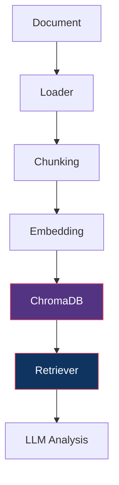
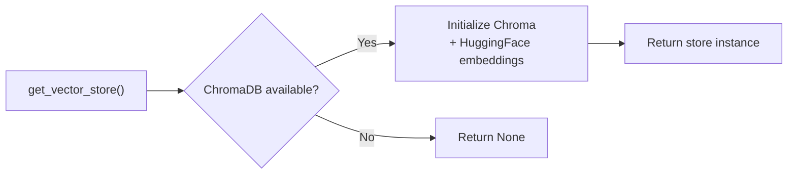
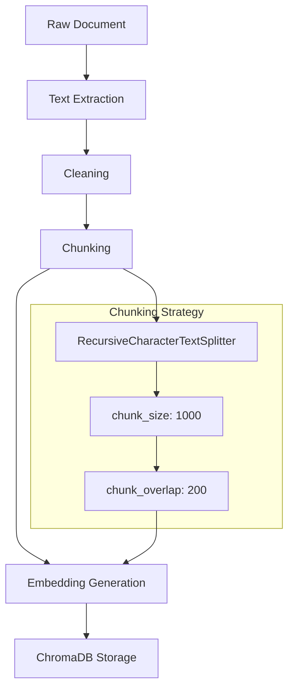
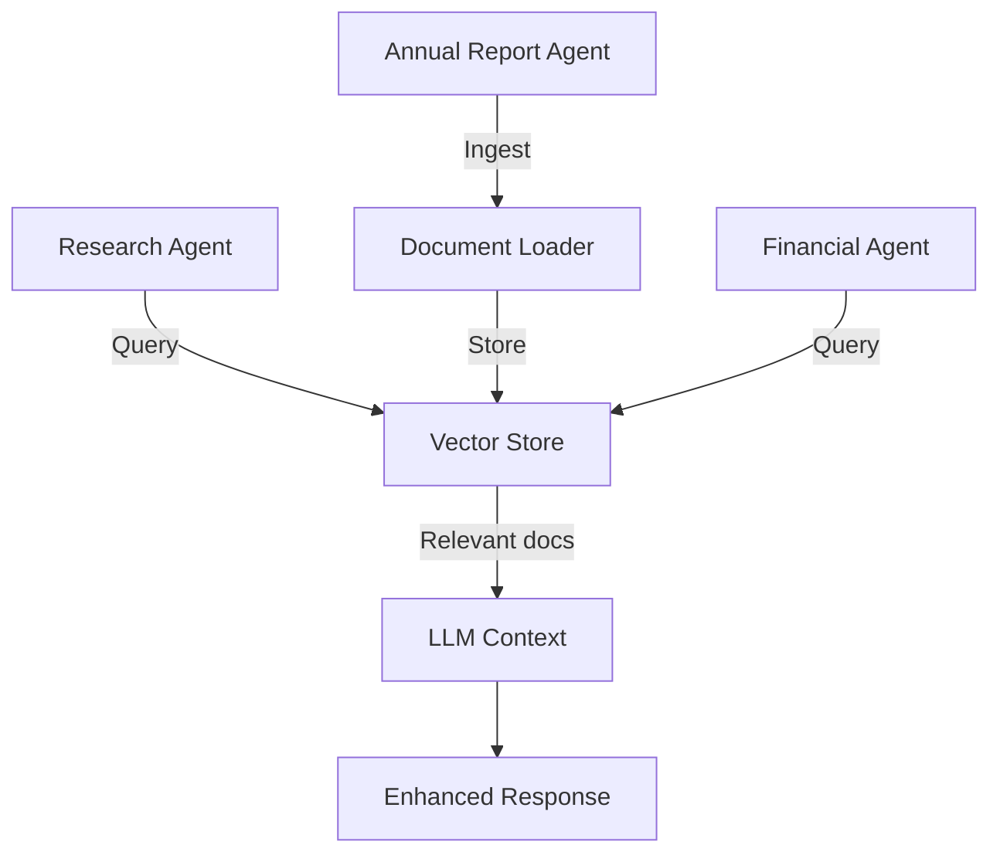
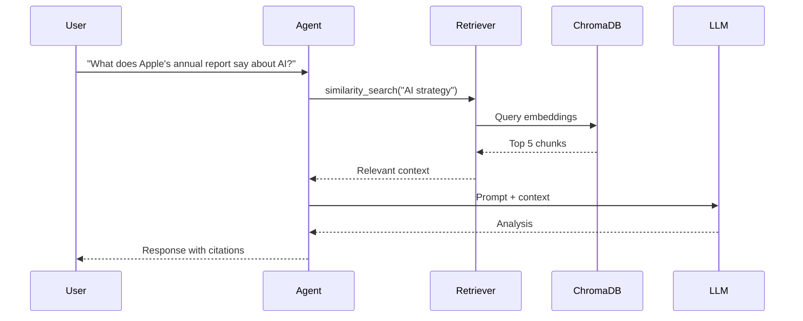

# RAG Pipeline Documentation

Retrieval-Augmented Generation (RAG) pipeline for document ingestion and semantic search. Currently stubbed for Phase 4 — ready for annual reports, earnings calls, and SEC filings.

---

## Architecture



---

## Components

### Document Sources

| Document Type | Source | Status |
|:--|:--|:--|
| Annual Reports | PDF upload | Phase 4 |
| Earnings Reports | PDF/HTML | Phase 4 |
| Earnings Call Transcripts | Text/PDF | Phase 4 |
| Investor Presentations | PDF | Phase 4 |
| SEC Filings | EDGAR API | Phase 4 |
| NSE/BSE Filings | Exchange API | Phase 4 |

### Embeddings

| Model | Dimension | Use Case |
|:--|:--|:--|
| `BAAI/bge-large-en-v1.5` | 1024 | Primary (high quality) |
| `nomic-embed-text` | 768 | Alternative (faster) |

### Vector Store

| Property | Value |
|:--|:--|
| Database | ChromaDB |
| Collection | `research_findings` |
| Persist Directory | `./chroma_db` |
| Distance Metric | Cosine similarity |

---

## Implementation

### Current Stub (`rag/chroma_store.py`)



### Functions

| Function | Purpose | Status |
|:--|:--|:--|
| `get_vector_store()` | Get/create ChromaDB instance | Implemented |
| `store_documents(docs)` | Store documents in vector DB | Implemented |
| `query_similar(query, k)` | Semantic search | Implemented |

### Usage

```python
from rag.chroma_store import get_vector_store, store_documents, query_similar
from langchain_core.documents import Document

# Get vector store
store = get_vector_store()

# Store documents
docs = [
    Document(page_content="Apple Inc reported Q4 revenue of $94.8B...", metadata={"source": "10-K"})
]
store_documents(docs)

# Query
results = query_similar("What was Apple's revenue growth?", k=5)
for doc in results:
    print(doc.page_content)
```

---

## Document Processing Pipeline



### Chunking Parameters

| Parameter | Value | Rationale |
|:--|:--|:--|
| `chunk_size` | 1000 chars | Balances context vs precision |
| `chunk_overlap` | 200 chars | Maintains context across chunks |
| `separator` | `\n\n` | Respects paragraph boundaries |

---

## Integration Points

### How RAG Connects to Agents



### Agent Integration (Phase 4)

| Agent | RAG Usage |
|:--|:--|
| Research Agent | Query previous research findings |
| Financial Agent | Retrieve historical financial data |
| Annual Report Agent | Ingest and query annual reports |
| Comparison Agent | Retrieve competitor data |

---

## Configuration

### Environment Variables

```env
# ChromaDB (local)
CHROMA_PERSIST_DIRECTORY=./chroma_db

# Embeddings (HuggingFace)
EMBEDDING_MODEL=BAAI/bge-large-en-v1.5
```

### Dependencies

```toml
# pyproject.toml
"langchain-chroma",
"chromadb",
"langchain-huggingface",
```

---

## Data Flow (Full RAG Cycle)



---

## Phase 4 Roadmap

### Planned Features

| Feature | Description |
|:--|:--|
| PDF Ingestion | Load annual reports, earnings transcripts |
| HTML Ingestion | Scrape and parse SEC filings |
| Smart Chunking | Section-aware splitting for financial docs |
| Metadata Filtering | Filter by document type, date, company |
| Hybrid Search | Combine semantic + keyword search |
| Re-ranking | Cross-encoder re-ranking of results |
| Incremental Updates | Auto-ingest new filings |

### Document Loaders (Planned)

```python
# Annual Report (PDF)
from langchain_community.document_loaders import PyPDFLoader
loader = PyPDFLoader("apple_10k_2024.pdf")

# Earnings Transcript (Text)
from langchain_community.document_loaders import TextLoader
loader = TextLoader("apple_q4_earnings.txt")

# SEC Filing (HTML)
from langchain_community.document_loaders import WebBaseLoader
loader = WebBaseLoader("https://sec.gov/...")

# Earnings Call (PDF)
loader = PyPDFLoader("apple_earnings_call_q4.pdf")
```

---

## Testing RAG

### Unit Test Pattern

```python
from rag.chroma_store import get_vector_store, store_documents, query_similar
from langchain_core.documents import Document

def test_store_and_query():
    store = get_vector_store()
    if store is None:
        pytest.skip("ChromaDB not available")
    
    # Store test document
    docs = [Document(page_content="Test content", metadata={"source": "test"})]
    result = store_documents(docs)
    assert result is True
    
    # Query
    results = query_similar("Test content", k=1)
    assert len(results) >= 1
```

---

## Performance Considerations

| Factor | Current | Optimized (Phase 4) |
|:--|:--|:--|
| Embedding speed | ~100 docs/sec | GPU-accelerated |
| Query latency | ~50ms | ~10ms with index |
| Storage | Local file | Chroma Cloud (optional) |
| Max documents | ~10K | 100K+ with proper indexing |
