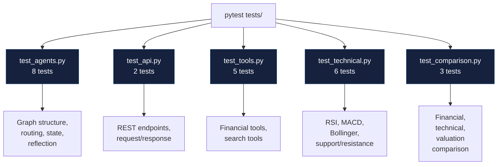

# Testing Guide

Comprehensive guide to running, writing, and maintaining tests for AlphaResearch AI.

---

## Test Architecture



---

## Running Tests

### All Tests

```bash
pytest tests/ -v
```

Expected output:
```
tests/test_agents.py      — 8 passed
tests/test_api.py         — 2 passed
tests/test_comparison.py  — 3 passed
tests/test_technical.py   — 6 passed
tests/test_tools.py       — 5 passed

24 passed in ~50s
```

### Specific Test File

```bash
pytest tests/test_agents.py -v
pytest tests/test_tools.py -v
pytest tests/test_technical.py -v
```

### Specific Test

```bash
pytest tests/test_agents.py::test_research_state_has_required_fields -v
```

### With Coverage

```bash
pytest tests/ --cov=. --cov-report=term-missing
```

### With Coverage Report

```bash
pytest tests/ --cov=. --cov-report=html
# Open htmlcov/index.html
```

---

## Test Breakdown

### `test_agents.py` — 8 Tests

| Test | Description |
|:--|:--|
| `test_research_state_has_required_fields` | Verifies ResearchState TypedDict has all required fields |
| `test_reflection_stops_after_max_cycles` | Reflection returns RESEARCH_COMPLETE after 3 cycles |
| `test_route_after_supervisor_returns_parallel_nodes` | Supervisor routes to both subgraphs |
| `test_route_after_aggregation_comparison` | Routes to comparison node for comparison queries |
| `test_route_after_aggregation_single_stock` | Routes to reflection for single stock queries |
| `test_route_after_reflection_complete` | Routes to writer when reflection passes |
| `test_route_after_reflection_needs_work` | Routes back to supervisor when issues found |
| `test_fallback_reflection_checks_completeness` | Fallback reflection checks basic completeness |

### `test_api.py` — 2 Tests

| Test | Description |
|:--|:--|
| `test_health_endpoint` | GET /health returns 200 with status |
| `test_research_endpoint` | POST /api/research accepts valid query |

### `test_tools.py` — 5 Tests

| Test | Description |
|:--|:--|
| `test_get_stock_info` | Yahoo Finance returns company data |
| `test_get_financial_metrics` | Financial metrics retrieval |
| `test_get_stock_history` | Price history retrieval |
| `test_web_search` | MCP search tool works |
| `test_duckduckgo_search` | Local DDG search works |

### `test_technical.py` — 6 Tests

| Test | Description |
|:--|:--|
| `test_calculate_technical_indicators` | RSI, MACD, Bollinger calculation |
| `test_rsi_overbought` | RSI correctly identifies overbought |
| `test_rsi_oversold` | RSI correctly identifies oversold |
| `test_support_resistance` | Pivot point calculation |
| `test_volume_analysis` | OBV and volume trends |
| `test_trend_analysis` | ADX and trend direction |

### `test_comparison.py` — 3 Tests

| Test | Description |
|:--|:--|
| `test_compare_financials` | Side-by-side financial metrics |
| `test_compare_technicals` | Technical indicator comparison |
| `test_compare_valuation` | Valuation ratio comparison |

---

## Writing New Tests

### Test Structure

```python
"""Tests for [module name]."""

import pytest
from unittest.mock import patch, MagicMock


def test_[feature]_[scenario]():
    """Test that [feature] [expected behavior]."""
    # Arrange
    input_data = "..."
    
    # Act
    result = function_under_test(input_data)
    
    # Assert
    assert result == expected_output
```

### Mocking LLM Calls

```python
from unittest.mock import patch, MagicMock

@patch("models.routing.ChatLiteLLM")
def test_supervisor_with_mocked_llm(mock_llm):
    """Test supervisor with mocked LLM response."""
    # Mock the LLM response
    mock_response = MagicMock()
    mock_response.query_type = "single_stock"
    mock_response.company = "Apple Inc"
    mock_response.ticker = "AAPL"
    mock_response.target_companies = [{"company": "Apple Inc", "ticker": "AAPL"}]
    
    mock_model = MagicMock()
    mock_model.with_structured_output.return_value.invoke.return_value = mock_response
    mock_llm.return_value = mock_model
    
    # Test
    from agents.supervisor import supervisor_node
    result = supervisor_node({"user_query": "Analyze Apple"})
    
    assert result["company"] == "Apple Inc"
    assert result["ticker"] == "AAPL"
```

### Mocking External APIs

```python
@patch("tools.financial_tools.yf")
def test_get_stock_info_mocked(mock_yf):
    """Test stock info with mocked Yahoo Finance."""
    mock_stock = MagicMock()
    mock_stock.info = {
        "shortName": "Apple Inc",
        "sector": "Technology",
        "marketCap": 3000000000000,
    }
    mock_yf.Ticker.return_value = mock_stock
    
    from tools.financial_tools import get_stock_info
    result = get_stock_info.invoke("AAPL")
    
    assert "Apple" in result
```

### Testing Graph Routing

```python
def test_conditional_routing():
    """Test graph routing logic."""
    from agents.supervisor import route_after_aggregation
    
    # Single stock query
    state = {"query_type": "single_stock"}
    assert route_after_aggregation(state) == "reflection"
    
    # Comparison query
    state = {"query_type": "comparison"}
    assert route_after_aggregation(state) == "comparison"
```

### Testing Error Handling

```python
def test_agent_returns_error_on_failure():
    """Test agent graceful degradation."""
    from agents.supervisor import research_node
    
    # State with missing ticker
    state = {"company": "Test", "ticker": ""}
    
    # Should not raise, should return error state
    result = research_node(state)
    assert "research_findings" in result
```

---

## Test Configuration

### `pyproject.toml`

```toml
[project.optional-dependencies]
dev = [
    "pytest",
    "pytest-asyncio",
    "httpx",
    "pytest-cov",
]
```

### pytest Settings

```ini
# pytest.ini or pyproject.toml
[tool.pytest.ini_options]
testpaths = ["tests"]
asyncio_mode = "auto"
```

---

## CI/CD Integration

### GitHub Actions

```yaml
name: Tests
on: [push, pull_request]

jobs:
  test:
    runs-on: ubuntu-latest
    steps:
      - uses: actions/checkout@v4
      - uses: actions/setup-python@v5
        with:
          python-version: "3.11"
      - run: pip install -e ".[dev]"
      - run: pytest tests/ -v --cov=.
      - uses: codecov/codecov-action@v4
```

---

## Test Data

### Mock Financial Data

```python
MOCK_STOCK_INFO = {
    "shortName": "Apple Inc",
    "longName": "Apple Inc.",
    "sector": "Technology",
    "industry": "Consumer Electronics",
    "marketCap": 3000000000000,
    "currency": "USD",
}

MOCK_TECHNICAL_DATA = {
    "rsi": 62.4,
    "macd": 1.23,
    "macd_signal": 0.98,
    "bollinger_upper": 195.20,
    "bollinger_lower": 178.50,
}
```

---

## Debugging Tests

### Verbose Output

```bash
pytest tests/ -v -s
```

### Stop on First Failure

```bash
pytest tests/ -x
```

### Run Last Failed

```bash
pytest tests/ --lf
```

### Show Local Variables on Failure

```bash
pytest tests/ -v --tb=short
```

---

## Coverage Targets

| Module | Target | Current |
|:--|:--|:--|
| `agents/` | 80% | ~75% |
| `tools/` | 85% | ~80% |
| `models/` | 90% | ~85% |
| `app/` | 80% | ~70% |
| **Overall** | **80%** | **~78%** |
