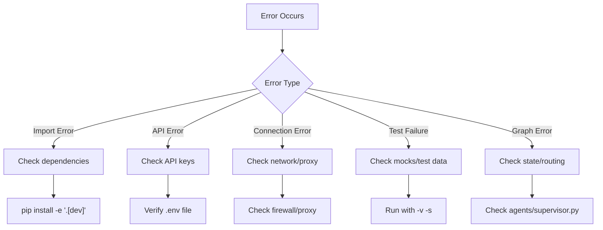

# Troubleshooting Guide

Common errors, fixes, and debugging tips for AlphaResearch AI.

---

## Quick Diagnosis



---

## Common Errors

### 1. Import Errors

**Error:**
```
ModuleNotFoundError: No module named 'langgraph'
```

**Fix:**
```bash
pip install -e ".[dev]"
# or
uv sync
```

**Error:**
```
ModuleNotFoundError: No module named 'deepagents'
```

**Fix:**
```bash
pip install deepagents
```

---

### 2. API Key Errors

**Error:**
```
Error: 401 Unauthorized
```

**Diagnosis:**
```bash
# Check if .env exists
cat .env | grep GEMINI_API_KEY

# Verify key is not empty
python -c "from app.config import settings; print('GEMINI:', bool(settings.gemini_api_key))"
```

**Fix:**
1. Verify API key is correct (no extra spaces)
2. Check key hasn't expired
3. Verify billing is enabled (for paid tiers)

---

### 3. Model Not Found

**Error:**
```
Model not found: openrouter/nex-agi/nex-n2-pro:free
```

**Fix:**
1. Check OpenRouter account has access to the model
2. Verify `OPENROUTER_API_KEY` is set
3. Try fallback: `get_model_with_fallback()` instead of `get_model()`

---

### 4. Rate Limit Errors

**Error:**
```
429 Too Many Requests
```

**Fix:**
```python
# Use fallback chain
from models.routing import get_model_with_fallback
model = get_model_with_fallback(task="research")

# Or add delay
import time
time.sleep(1)
```

---

### 5. DuckDuckGo Returns Empty

**Error:**
```
No DuckDuckGo search results for: ...
```

**Cause:** DuckDuckGo rate limits cloud IPs (Render, AWS, etc.)

**Fix:**
1. Use MCP Web Search Server instead (handles this)
2. Use Tavily as primary search
3. Run locally (DDG works from residential IPs)

---

### 6. MCP Server Unreachable

**Error:**
```
Connection error to mcp-web-search-nwgd.onrender.com
```

**Fix:**
1. Check Render service status
2. `web_search()` auto-falls back to local DuckDuckGo
3. Deploy your own MCP server if needed

---

### 7. Test Failures

**Error:**
```
assert 0 == 1
```

**Debug:**
```bash
# Run with verbose output
pytest tests/test_agents.py -v -s

# Run specific test
pytest tests/test_agents.py::test_route_after_supervisor -v -s

# Show local variables
pytest tests/test_agents.py -v --tb=long
```

---

### 8. CancelledError During Research

**Error:**
```
asyncio.exceptions.CancelledError
```

**Cause:** The LangGraph async runner raises `CancelledError` when:
- A node timeout fires (10 min run / 2 min idle)
- The client disconnects while research is in progress
- The server shuts down during an active request

**In Python 3.11+**, `CancelledError` derives from `BaseException`, not `Exception`. This means `except Exception` blocks won't catch it.

**Fix:** The system now handles this at three levels:
1. Agent nodes re-raise `CancelledError` so LangGraph's retry policy handles it
2. API endpoints catch it and return HTTP 499 (client closed request)
3. The lifespan handler drains in-flight requests for 5 seconds on shutdown

If you see this error persisting:
```bash
# Check if the timeout is too aggressive for your query complexity
# Default: run_timeout=600s, idle_timeout=120s in agents/supervisor.py
# You can adjust _AGENT_TIMEOUT for your use case
```

---

### 9. LangGraph Server Won't Start

**Error:**
```
langgraph dev failed
```

**Fix:**
```bash
# Check langgraph.json exists
cat langgraph.json

# Verify graph.py exists
ls graph.py

# Check for import errors
python -c "from agents.supervisor import graph"

# Try explicit host/port
langgraph dev --host 0.0.0.0 --port 2024
```

---

### 10. FastAPI Won't Start

**Error:**
```
ModuleNotFoundError: No module named 'app'
```

**Fix:**
```bash
# Make sure you're in project root
cd AlphaResearch-AI

# Run from project root
uvicorn app.main:app --reload
```

---

### 11. ChromaDB Errors

**Error:**
```
ImportError: No module named 'langchain_chroma'
```

**Fix:**
```bash
pip install langchain-chroma chromadb langchain-huggingface
```

**Note:** ChromaDB is optional. The app works without it (RAG is stubbed).

---

## Debugging Workflows

### Debug a Single Agent

```python
import asyncio
from agents.supervisor import supervisor_node

state = {"user_query": "Analyze Apple Inc", "messages": []}
result = asyncio.run(supervisor_node(state))
print(result)
```

### Debug Model Routing

```python
from models.routing import get_model, MODEL_ROUTING

print("Routing table:")
for task, model in MODEL_ROUTING.items():
    print(f"  {task}: {model}")

model = get_model(task="planning")
print(f"Selected: {model.model_name}")
```

### Debug Graph Flow

```python
from agents.supervisor import build_graph

graph = build_graph()

# Visualize graph
print(graph.get_graph().draw_mermaid())
```

### Debug Search Tools

```python
from tools.search_tools import web_search, duckduckgo_search

# Test MCP search
result = web_search.invoke("Apple stock price")
print(result[:500])

# Test local DDG
result = duckduckgo_search.invoke("Apple stock price")
print(result[:500])
```

---

## Performance Issues

### Slow API Responses

**Cause:** LLM calls taking too long

**Fix:**
1. Use faster models (Groq for research)
2. Reduce reflection cycles
3. Add timeout to LLM calls
4. Cache frequent queries

### High Token Usage

**Cause:** Long prompts or verbose agents

**Fix:**
1. Shorten system prompts
2. Use `temperature=0` for deterministic tasks
3. Limit agent tool usage
4. Add token budgets

---

## Environment Issues

### `.env` Not Loading

```python
# Verify
from app.config import settings
print(settings.gemini_api_key)  # Should show key or empty string
```

### Wrong Python Version

```bash
python --version  # Should be 3.11+

# If wrong:
pyenv install 3.11
pyenv local 3.11
```

### Virtual Environment Issues

```bash
# Recreate
rm -rf .venv
python -m venv .venv
source .venv/bin/activate  # or .venv\Scripts\activate on Windows
pip install -e ".[dev]"
```

---

## Logging

### Enable Debug Logging

```python
# In app/main.py or script
import logging
logging.basicConfig(level=logging.DEBUG)
```

### View Agent Logs

```bash
# FastAPI logs
uvicorn app.main:app --log-level debug

# LangGraph logs
langgraph dev --verbose
```

---

## Getting Help

1. Check this troubleshooting guide
2. Run tests: `pytest tests/ -v`
3. Check logs for error messages
4. Review `IMPLEMENTATION_PLAN.md` for phase details
5. Check GitHub Issues for known problems
